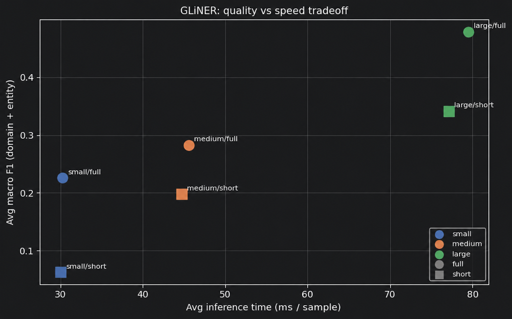

## Эксперименты

Данный файл содержит результаты тестирования различных моделей.

Модели проверялись на датасете [hivetrace-pii-bench](https://huggingface.co/datasets/hivetrace/pii-bench).

Датасет состоит из двух подмножеств (entity & domain) и включает 13 классов персональных данных:

NAME,
ADDRESS,
PHONE_NUMBER,
BANK_CARD_NUMBER,
CVC,
EMAIL,
INN,
KPP,
OGRN,
OGRNIP,
PASSPORT_NUMBER,
SNILS,
TOKEN

Все приведенные метрики рассчитаны по парадигме exact-match если не указано иное.

Особое внимание уделяется классам NAME и ADDRESS, так как их можно адекватно обрабатывать только моделями,
тогда как прочие классы можно успешно ловить регулярными выражениями и контекстными правилами.
Отдельная сложность в классе адреса заключается в том, что нам необходимо выделять адрес целиком, 
при всем возможном разнообразии форматов, тогда как многие модели выделяют данную сущность частично (как "Место") или
разбивают на части, что усложняет обработку.

### Openai Privary Filter (OPF) ([ссылка](https://huggingface.co/openai/privacy-filter))

Тяжелая (1B) мультиязычная модель для фильтрации персональных данных от OpenAI.
Имеет фиксированный набор классов: account_number, private_address, private_email, 
private_person, private_phone, private_url, private_date, secret.

Точность на неструктурированных классах (entity subset):

| Класс           | Precision | Recall | F1-score | # samples |
|-----------------|-----------|--------|----------|-----------|
| private_person  | 0.62      | 0.67   | 0.64     | 70        |
| private_address | 0.37      | 0.51   | 0.43     | 70        |

Precision на большинстве структурированных классов сложно оценить, т.к. невозможно сделать
однозначный матчинг "класс модели - класс ПД". Т.е. большинство номеров документов определяется моделью как account_number.
Более того, модель не всегда стабильно предсказывает одному классу ПД один и тот же свой тип, например,
номер снилс часто определяется как номер телефона, а номер телефона как account_number.

Если же рассмотреть отдельно только recall, результаты получаются следующие:

| Класс            | Recall |
|------------------|--------|
| EMAIL            | 0,9286 |
| TOKEN            | 0,9571 |
| NAME             | 0,6714 |
| PHONE_NUMBER     | 0,7857 |
| PASSPORT_NUMBER  | 0,7857 |
| BANK_CARD_NUMBER | 0,5857 |
| ADDRESS          | 0,5143 |
| INN              | 0,3    |
| OGRNIP           | 0,1857 |
| KPP              | 0,1714 |
| OGRN             | 0,1286 |
| SNILS            | 0,0571 |
| CVC              | 0      |

Приведенных результатов достаточно, чтобы сделать вывод о слишком низкой точности модели для русскоязычных ПД.

Дообучение модели хоть и возможно, но будет требовать большого количества данных, которые на русском языке отсутствуют в должном объеме.

Также размер этой модели делает ее инференс медленным, что не укладывается в формат "легковесного прокси", который мы хотим получить в итоге.

### GLiNER 2.5 ([ссылка](https://huggingface.co/collections/urchade/gliner-v25))

Мультиязычная модель для детекции ПД. Есть три версии модели (от 600 до 1800 МБ).

Фишкой модели является zero-shot детекция любых сущностей, что позволяет явно задать требуемые классы.

Отдельным нюансом при работе с моделью является способ задавать метки. Например, как задать ИНН? (просто ИНН, или расшифровать для лучшего понимания?)
Два таких варианта были протестированы как full и short.

График ниже показывает макро F1 трех моделей с двумя способами задания меток на всем датасете.

Результаты также неудовлетворительные, и самая большая модель работает в среднем на уровне с OPF.

### GLiNER PII (от [knowledgator](https://huggingface.co/knowledgator/gliner-pii-large-v1.0) и [NVIDIA](https://huggingface.co/nvidia/gliner-PII))

У knowledgator (kg) и NVIDIA есть свои версии модели GLiNER, дообученные специально для детекции ПД.

KG имеет три версии моделей - дообученные small, base, large, а NVIDIA - одну large.

Ниже приведены результаты обоих large моделей, т.к. они показывают лучшие результаты, сильно превосходящие small и base.

Таблицы отображает F1 на entity сабсете для каждого класса + макро.

| Класс            | GLiNER PII (kg) | GLiNER PII (NVIDIA) |
|------------------|-----------------|---------------------|
| ADDRESS          | 0.7634          | 0.562               |
| BANK_CARD_NUMBER | 0.8552          | 0.6849              |
| CVC              | 0.7769          | 0.6140              |
| EMAIL            | 1.0000          | 1.0000              |
| INN              | 0.9571          | 0.9706              |
| KPP              | 0.9474          | 0.8182              |
| NAME             | 0.9859          | 0.0090              |
| OGRN             | 0.9173          | 0.8112              |
| OGRNIP           | 0.2500          | 0.8889              |
| PASSPORT_NUMBER  | 0.7612          | 0.8175              |
| PHONE_NUMBER     | 0.8951          | 0.7395              |
| SNILS            | 0.9781          | 0.9160              |
| TOKEN            | 0.3654          | 0.9645              |
| \_MACRO_         | 0.8041          | 0.7536              |

Данные модели уже показывают адекватные результаты и близкий макро F1.
Однако, можно заметить, что модель NVIDIA плохо работает с именами и адресами, несмотря на хорошее качество выделения других сущностей.

Несмотря на в целом хорошие метрики модели kg, с просадкой всего на нескольких классах, данный результат является скорее
информативным, т.к. модель слишком тяжелая.

### Прочие модели

Также рассматривались модели [spaCy](https://huggingface.co/spacy/ru_core_news_lg) и [Natasha](https://github.com/natasha/nerus).

Дополнительно рассматривалась модель flair, однако для русского языка модели не нашлось, поэтому как ближайший аналог
тестировалась [версия](https://huggingface.co/lang-uk/flair-uk-ner) для украинского языка.

Данные модели работают быстро, но решают задачу выделения классов PERSON, LOCATION и ORGANIZATION.
При этом, для решения нашей задачи нужно как минимум выделять имена и адреса. И если класс PERSON соответствует тому что нам нужно,
то LOCATION выделяет "место", а не полный адрес (чаще всего только город).

Если же все-таки замерять метрики по классам PERSON и LOCATION, то результаты будут следующими:

| Класс    | spaCy F1 | Natasha F1 | flair F1 |
|----------|----------|------------|----------|
| PERSON   | 0.87     | 0.9        | 0.73     |
| LOCATION | 0.10     | 0.05       | 0.05     |

## Выводы

Протестированные модели можно разделить на три группы.

**Тяжёлые мультиязычные модели** (OPF, GLiNER 2.5) показывают неудовлетворительное качество на русскоязычных ПД и при этом слишком медленны для использования в роли лёгкого прокси-сервиса. Их дообучение требует большого объёма размеченных данных, которых для русского языка недостаточно.

**Специализированные GLiNER-модели** (knowledgator, NVIDIA) дают уже приемлемые метрики, однако имеют существенные недостатки. Модель NVIDIA фактически не справляется с именами (F1 = 0.009). Модель knowledgator показывает хорошие результаты в целом, но остаётся слишком медленной для встраивания в прокси.

**Лёгкие NER-модели** (spaCy, Natasha, flair) быстрые, но оперируют не теми метками: вместо полного адреса выделяют только «место» (как правило, город), что делает их непригодными для класса ADDRESS без дообучения.

Отдельно стоит отметить, что большинство классов ПД (EMAIL, PHONE_NUMBER, INN, СНИЛС, номера документов и т.д.) имеют строго фиксированный формат и надёжно покрываются регулярными выражениями — здесь модели не дают никакого преимущества.

Таким образом, проблема сводится к двум классам — NAME и ADDRESS, где вариативность текста делает регулярки неприменимыми. В качестве итогового подхода было принято решение дообучить компактную NER-модель именно на эти два класса: это требует относительно небольшого обучающего датасета, обеспечивает быстрый инференс, и хорошо вписывается в архитектуру прокси-сервиса. Оставшиеся структурированные классы покрываются регулярными выражениями и контекстными правилами.
